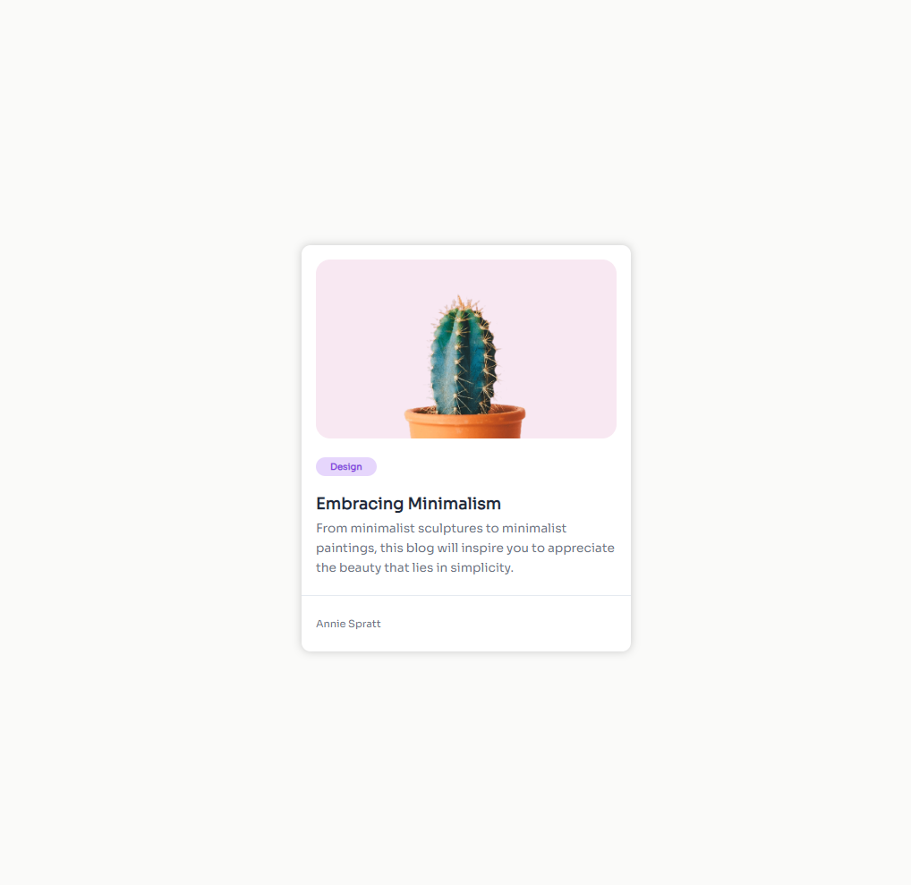

# Minimal Blog Card

This project is a challenge from [devchallenges.io](https://devchallenges.io) to create a minimal blog card using only HTML and CSS. The goal of this challenge is to sharpen my skills in front-end development.

## Description

In this project, I created a simple and elegant blog card that showcases the beauty of minimalism. The card includes a background image, a tag, a title, a brief description, and author information.

### Key Features

- **HTML & CSS Only**: This project is built using only HTML and CSS, without any JavaScript.
- **Responsive Design**: The card is designed to be responsive and looks good on different screen sizes.
- **Image Containment**: Learned and applied techniques to properly contain an image within its container using CSS.

## Skills Improved

- Semantic HTML
- CSS Flexbox
- Background image containment
- Responsive design

## Screenshots



## How to Use

1. Clone the repository:
   ```bash
   git clone https://github.com/amirat9/minimal-blog-card.git
   ```
2. Navigate to the project directory:
   ```bash
   cd minimal-blog-card
   ```
3. Open the `index.html` file in your browser.

## Lessons Learned

- How to contain an image within its container using CSS.
- How to create a simple and elegant design using minimal elements.
- How to make a card responsive using CSS Flexbox.

## Author

- [Amir Taherian](https://github.com/Amirat9)

## Acknowledgements

- [devchallenges.io](https://devchallenges.io) for providing this challenge.
- [Unsplash](https://unsplash.com) for the beautiful background image.
- [Google Fonts](https://fonts.google.com) for the font styles.
